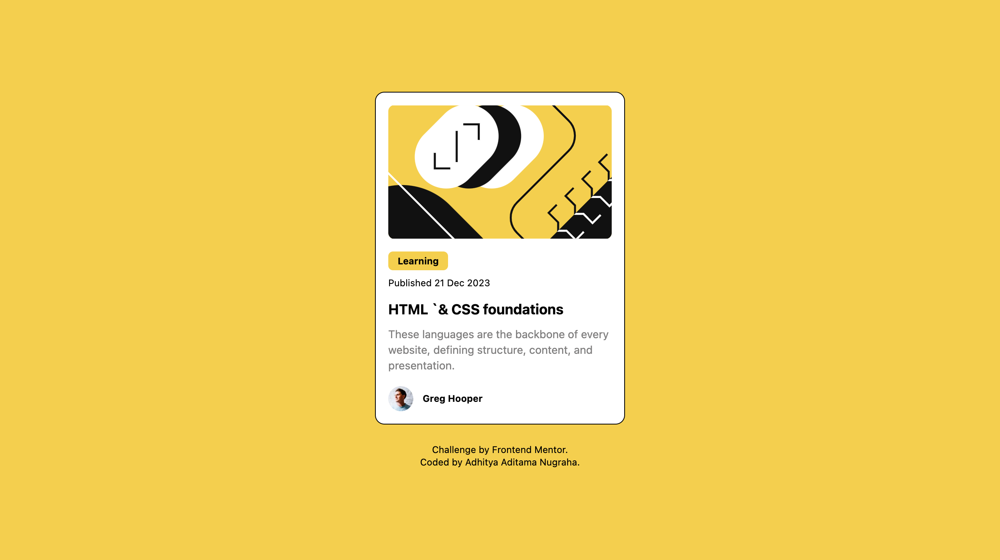

# Frontend Mentor - Blog preview card solution

This is a solution to the [Blog preview card challenge on Frontend Mentor](https://www.frontendmentor.io/challenges/blog-preview-card-ckPaj01IcS). Frontend Mentor challenges help you improve your coding skills by building realistic projects.

## Table of contents

- [Overview](#overview)
  - [The challenge](#the-challenge)
  - [Screenshot](#screenshot)
  - [Links](#links)
- [My process](#my-process)
  - [Built with](#built-with)
  - [What I learned](#what-i-learned)
  - [Continued development](#continued-development)
  - [Useful resources](#useful-resources)
- [Author](#author)
- [Acknowledgments](#acknowledgments)

## Overview

### The challenge

Users should be able to:

- See hover and focus states for all interactive elements on the page

### Screenshot

- Desktop preview
  
- Mobile preview
  

### Links

- Solution URL: [Add solution URL here](https://your-solution-url.com)
- Live Site URL: [Add live site URL here](https://your-live-site-url.com)

## My process

### Built with

- Semantic HTML5 markup
- CSS custom properties
- CSS Grid
- Mobile-first workflow

### What I learned

This is the second project that I use [Tailwind CSS](https://www.tailwindcss.com) for styling. It's very easy to use for beginners, just add simple class to your HTML file and that's it. If you forget or don't know about custom class for Tailwind, just read the docs. Always read the docs.

Yes there are some difficukty when I first time try to use Tailwind CSS. Some bugs like when I wanted to apply custom drop shadow to the main card and it did'nt appear like I hope.

### Continued development

Need more time to figure it out. Just keep learning, discipline.

## Author

- Frontend Mentor - [@yourusername](https://www.frontendmentor.io/profile/aaditamanugraha)
